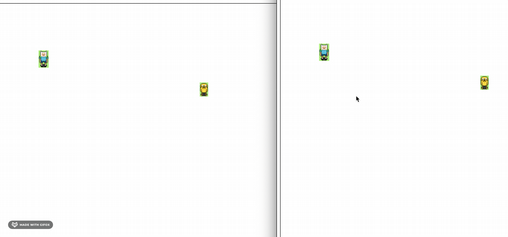

# pega-pega-websocket

Executar
2. Abra 1 terminal na pasta server
    npm install
    npm start
3. Abra outro terminal na pasta client
    npm install
    npm start
4. abrir o chrome
    http://localhost:8083
5. abrir o firefox
    http://localhost:8083

6. Ande com o W A S D

Demo

